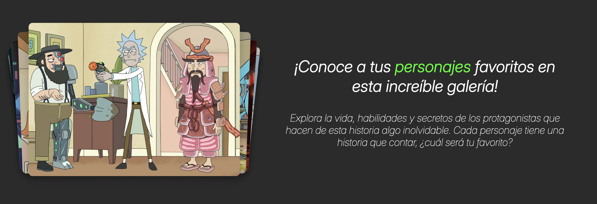
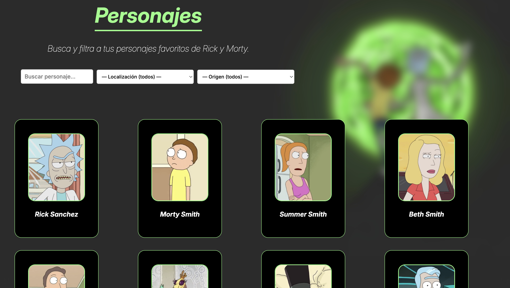
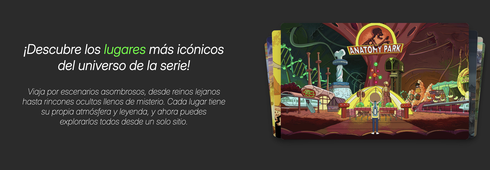
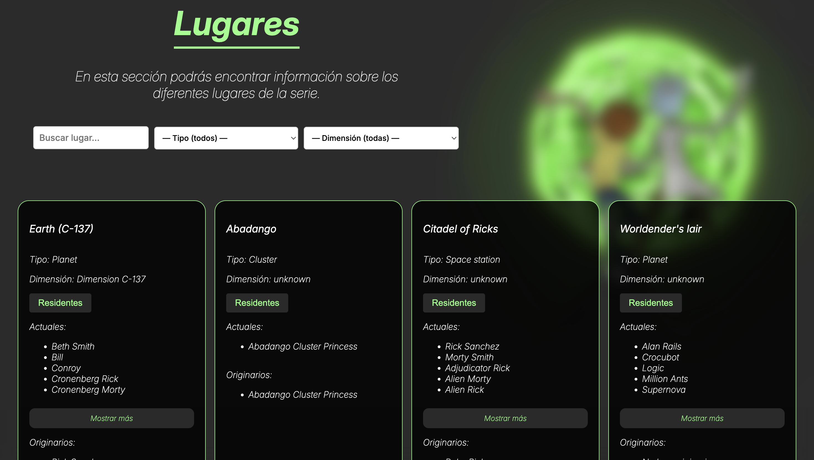
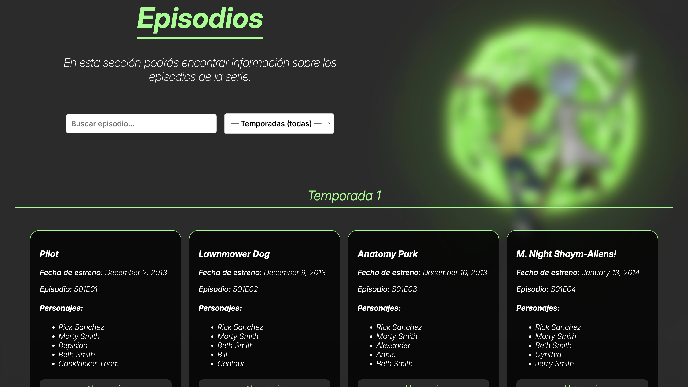

<div align="center">
  
</div>

# Requisitos
- [Npm](https://docs.npmjs.com/downloading-and-installing-node-js-and-npm)
# Instalación
1. Clona y accede al repositorio:
```bash
git clone https://github.com/AitorGH13/rick-morty-webapp.git ; cd rick-morty-webapp
```
2. Instala las dependencias mediante npm:
```bash
npm install
```
3. Arranca el proyecto:
```bash
npm start
```
# Secciones
## Personajes
<div align="center">
    
    
</div>

## Lugares
<div align="center">
    
    
</div>

## Episodios
<div align="center">
    
    
</div>
